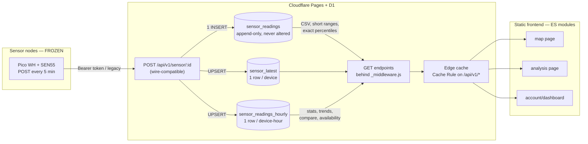

# Enviro Map — Rework Design Document

**Status: DRAFT — for review, no implementation yet**

Scope: everything except the sensor ingest contract (`POST /api/v1/sensor/{device_id}`),
which is frozen for both token-auth and legacy no-auth devices. Platform stays
Cloudflare Pages + D1. SQLite dialect only.

Working assumptions used for row-read estimates (please confirm in §8):

- Sensors post every **5 minutes** (`interval = 300000` in `sensor/sensor_v1/sensor_v1.ino:53`)
  → **288 readings/sensor/day**, ~105,000/sensor/year.
- Fleet size (confirmed): **22 registered sensors, ~2 currently posting**. Per-call
  estimates below were drawn for ~5–10 active sensors; scale them by the number of
  sensors actually selected/posting. Two consequences worth noting: the map page's
  `/latest` fan-out is **22 requests per visitor** regardless of how many sensors are
  live, and rollup write overhead is trivial (~576 extra row writes/day per derived
  table at current posting volume).
- Total `sensor_readings` size: **~1.5–2M rows estimated** from 224 MB measured
  storage (includes both indexes); historical rows from the 20 now-quiet sensors
  dominate. Exact counts optional (see WP0 note on what counting costs).
- Measured baseline (D1 dashboard, 7 days to 2026-06-13): **~4k queries, ~120k rows
  read, ~16k rows written, 224 MB stored.** Cross-checks: ~570 queries/day matches 2
  sensors × 288 posts/day — query volume is essentially all ingest, visitor traffic
  is currently negligible; ~16k writes/week matches 576 inserts/day × 3 row-writes
  each (table + two indexes), confirming every insert pays for both indexes (§3.4).

**Cost context (measured):** at ~17k rows read/day the system sits at ~0.3 % of D1's
free-tier daily read allowance (5M/day). The row-read work in this plan is therefore
not about today's bill — it is about tail risk and headroom: a single full-history
availability call reads ~1.5M rows (~30 % of a day's free quota in one request), one
map visitor triggers the 22-device `/latest` fan-out, and read volume scales with
visitors × range length with no upper bound. After WP2–WP4, per-request reads are
small bounded constants and traffic spikes land on the edge cache instead of D1.
- Production indexes (confirmed from `sqlite_master`): `sensor_readings` carries
  **both** `(device_id, event_time)` and `(event_time, device_id)`. The API README
  (`frontend/functions/api/README.md`) lists the latter under "possible alternative
  indexes, NOT IN USE" — the docs have drifted from production; correct them as part
  of WP1.

---

## 1. Current state diagnosis

Ranked by impact. Row-read figures use the assumptions above.

### SEV-1: `statistics.js` percentile loop — one ordered scan per sensor per metric

`frontend/functions/api/v1/analysis/statistics.js:77-94`: nested `for sensorId / for metric`
loop, each iteration runs:

```sql
SELECT {column} FROM sensor_readings WHERE device_id = ? AND event_time BETWEEN ? AND ?
  AND {column} IS NOT NULL ORDER BY {column}
```

For the default 7-day range: ~2,016 rows/sensor. 5 sensors × 5 metrics = 25 queries =
**~50,000 rows read per call**, on top of the main `GROUP BY` query (~10,000). Each
query also pays a sort on the value column. The percentile/stddev maths is then done
in JS anyway, so the `ORDER BY` buys nothing the app couldn't do.

Fixes: short-term, one un-ordered query per **sensor** fetching all metric columns at
once (5× cut, ~10k rows/call); long-term, hourly rollups (§3) take the recurring cost
to ~840 rows/call and stddev moves into SQL exactly (sum/sum-of-squares).

### SEV-2: `availability.js` reads every reading in the requested range

`frontend/functions/api/v1/sensors/availability.js:53`:

```sql
SELECT DISTINCT device_id FROM sensor_readings WHERE event_time >= ? AND event_time <= ?
```

Production has `idx_sensor_readings_event_time_device_id` (confirmed via
`sqlite_master`), so this is a covering index range scan, not a full table scan — but
rows read still equal **every reading from every sensor in the window**: ~2,900 for
the 24 h default, ~20,000 for 7 days, ~86,000 for 30 days, and approaching the full
table (~1M) if a user picks a whole-history custom range. It runs on every
`analysis.html` load and again on each time-range change (`analysis-manager.js:63`,
debounced 500 ms); the endpoint helpfully reports the damage (`rowsRead` in the
response body).

The question being asked is only "which sensors have ≥1 reading in range" — that
needs one index probe per sensor, not a scan of the range. Fix (no schema change) in
§4: cost drops to **~2 rows per sensor (~20 total), independent of range**. Once
rewritten, this query is the only consumer of the `(event_time, device_id)` index,
which then becomes droppable — see §3.4.

### SEV-2: `/sensor/{id}/latest` — `MAX()` with bare columns likely scans the device's full history

`frontend/functions/api/v1/sensor/[[catchall]].js:5-7`:

```sql
SELECT pm1, ..., MAX(event_time) AS time FROM sensor_readings WHERE device_id = ?
```

There is **no time bound**. SQLite's min/max index optimisation applies to bare
`SELECT MAX(x)` queries; with additional bare columns in the select list the planner
generally falls back to scanning all rows for that `device_id` — **up to ~105,000 rows
per call per sensor** after a year. Worse, the public map page calls this **once per
sensor per page load** (`data-manager.js:81`, batched 5 at a time): N sensors × full
history ≈ **~1M rows per cold map load**.

Fix: `... WHERE device_id = ? ORDER BY event_time DESC LIMIT 1` is a guaranteed
single index seek (1 row read). Better still: a `sensor_latest` table (§3) and one
`GET /sensors/latest` endpoint, collapsing N HTTP requests + N queries into one query
reading ~2N rows.

*Measurement caveat:* the 7-day baseline (120k total reads) is too low to be
consistent with this query scanning histories on real map traffic — either the map
had near-zero visits in the window, or the planner is applying the min/max
optimisation despite the bare columns. Settle it with `EXPLAIN QUERY PLAN` (WP0);
the `LIMIT 1` rewrite is correct in both cases, this only changes the urgency.

### SEV-2: every cacheable URL is unique — caching headers are dead weight

The backend sets sensible `Cache-Control` headers everywhere (e.g. `[sensorid].js:156`,
analysis endpoints: 300 s recent / 1800 s old). But the frontend builds URLs with
`from=${Date.now() - timespan}` (`data-manager.js:143`, `analysis-manager.js:272`),
so **every request URL differs by milliseconds**. Browser cache: never hit. Cloudflare
edge cache: never hit (and Pages Functions JSON isn't edge-cached by default anyway —
needs a Cache Rule). The entire caching layer is currently decorative.

Also inconsistent: `dashboard.js:53` adds a `?_t=${Date.now()}` cache-buster while the
server sets `Cache-Control: private, max-age=60` on the same endpoint — the client and
server are fighting each other. And `/download` caches for 1 h even for ranges ending
"now" (`[[catchall]].js:98`), which can serve stale CSV.

Fix: round `from`/`to` to 5-minute boundaries client-side; add one Cloudflare Cache
Rule for `GET /api/v1/*` honouring origin `Cache-Control`. After that, repeat map
loads cost **zero** D1 reads within the TTL.

### SEV-2: raw, unbounded time-series reads

`GET /api/v1/sensor/{id}` (`[sensorid].js:141`) returns every raw row in range with no
`LIMIT` and no aggregation: 288 rows for 24 h, 8,640 for 30 days — per call, re-fetched
by the polling loop in `app.js:107` every 2 min when client cache expires. The charts
plot raw points; for ranges beyond ~3 days, hourly buckets would look identical and
read 12× fewer rows. `compare.js`/`trends.js` aggregate in SQL (good) but still scan
raw rows: 5 sensors × 30 days = **~43,200 rows read per call**.

### SEV-2 (security, not cost): ingest spoofing — token check is skippable

`[sensorid].js:46-84`: token verification runs **only if** an `Authorization` header is
present. Anyone can POST fabricated readings for *any* device — including
token-protected ones — by simply omitting the header. Legacy compatibility only
requires that devices *without* tokens keep working; it does not require accepting
unauthenticated writes for devices that *have* tokens. There is also no check that
`device_id` exists at all, so arbitrary IDs can insert junk rows (paid writes).

**Decision (Q2): keep current behaviour — no enforcement.** Recorded as an accepted
risk: sensor tokens authenticate nothing that an attacker can't bypass by omitting
the header, so they are effectively decorative until this is revisited. The finding
stays in the doc so the risk acceptance is explicit and dated (2026-06-13).

### SEV-2 (security): stored XSS on the public map

`map-manager.js:25-32` interpolates `sensor.name` into popup HTML unescaped. Sensor
names are user-supplied at registration (`sensors/register.js`). Any registered user
can name a sensor `` and it executes for **every visitor** to
the public map. (`dashboard.js` escapes correctly; the map does not.)

Related: `login.js:158` / `register.js:179` reflect the submitted email into a
server-rendered HTML page. The email regex (`[^\s@]+@[^\s@]+\.[^\s@]+`) blocks
whitespace but not `<` or `>`, so `<svg/onload=...>@a.bc` passes validation —
reflected XSS.

### SEV-3 (security): JWT design issues

Detailed in §5. Headlines: login tokens and session tokens are interchangeable (no
type claim — a 7-day session token presented to `/verify` mints a fresh 7-day token,
i.e. **sessions renew themselves forever**); login links are GET with the JWT in the
query string (logged everywhere, prefetched by mail scanners) and are not single-use;
sessions live in `localStorage` (XSS-stealable — and we have an XSS above).

### SEV-3: structural problems

- **No shared code in the backend.** JWT verification is copy-pasted into 4 files
  (`verify.js`, `my-sensors.js`, `sensors/register.js`, `sensors/[device_id].js`);
  CORS headers and error responses are hand-rolled in all 11 function files, with
  drift (some return `{error: true, message}`, some `{error: "..."}`, ingest returns
  bare strings; wrong-order times returns **500** instead of 400 at `[sensorid].js:131`).
- **Data-validation bug:** `if (data.pm1)` at `[sensorid].js:98` rejects readings where
  `pm1 === 0` — i.e. **perfectly clean air is dropped with a 500**. Real data loss today.
- **Frontend is load-order-coupled globals.** Six script tags must load in exact order
  (`index.html:380-385`); `API_BASE` is defined twice with different values —
  `config.js:6` hard-codes the production origin (breaking local dev), `dashboard.js:6`
  uses a relative path. `analysis-manager.js` is a 1,360-line monolith mixing fetch,
  state, DOM templating, and chart config.
- **Un-pinned CDN dependency:** `index.html:376` and `analysis.html:617` load
  `cdn.jsdelivr.net/npm/apexcharts` with **no version and no SRI** — whatever jsDelivr
  serves tomorrow runs on the live site.
- **`DELETE /sensors/{id}` hard-deletes all readings** (`sensors/[device_id].js:39`),
  in tension with the "no data may be lost" principle (§8 Q3).
- `trends.js` ships `rawData` for every sensor/metric back in the JSON (large
  payloads), and ~180 lines of regression/seasonality/changepoint maths live in the
  endpoint. Not a row-read problem, but a complexity smell (see overengineering flags, §6).

### Per-call cost summary (current vs proposed)

| Endpoint | Rows read now (typical call) | After rework |
|---|---|---|
| `GET /sensors/availability` | rows in range: ~2,900 (24 h) → ~86,000 (30 d) | ~20 (EXISTS probes), range-independent |
| `GET /sensor/{id}/latest` × N on map load | up to ~1M cumulative | n/a — replaced |
| `GET /sensors/latest` (new) | — | ~2N (~20) |
| `GET /analysis/statistics` (5 sensors, 7 d) | ~60,000 | ~850 (rollups) |
| `GET /analysis/compare` (5 sensors, 7 d, hourly) | ~10,000 | ~850 |
| `GET /analysis/trends` (5 sensors, 30 d) | ~43,200 | ~3,600 |
| `GET /sensor/{id}` (24 h) | ~290 | ~290 raw / ~25 bucketed |
| `GET /sensors` | N | N (unchanged) |

Plus: the edge Cache Rule multiplies all of these by the cache hit rate — repeat
views within TTL cost zero.

---

## 2. Proposed architecture

The three-tier shape is right and stays. The changes are within tiers:

1. **A read model the dashboard can afford.** Two small derived tables —
   `sensor_latest` (one row per device) and `sensor_readings_hourly` (one row per
   device-hour) — maintained synchronously inside the existing ingest function.
   Dashboards and analysis read the derived tables; raw `sensor_readings` is written
   once, read only for CSV export, short-range charts, and exact percentiles.
2. **One shared backend core.** `_middleware.js` for CORS + error envelope + auth
   parsing; a shared `lib/` module for JWT, responses, and validation. Handlers
   shrink to: validate → query → respond.
3. **Edge caching that actually engages.** Rounded time parameters + one Cache Rule.
4. **Frontend as ES modules with a thin build step** (Vite, vanilla JS — no
   framework), one API client, one escape helper, no inline handlers.



**Explicitly NOT changing:**

- Ingest endpoint URL, request body, success/error responses for sensors
  (`201 - Indexed` text body included), and both auth modes.
- `sensor_readings` schema and contents — no row deleted, no value transformed.
- Cloudflare Pages + D1; file-based routing under `frontend/functions/api/`.
- Tabler CSS, Leaflet, ApexCharts; passwordless email login as the auth *concept*.
- No KV, no Durable Objects, no queues, no separate cron Worker (rollups are
  maintained inline on ingest precisely to avoid new infrastructure).

---

## 3. Database schema changes

All changes are **additive**: two new tables, one new small table for auth, optional
indexes. No `ALTER` of existing columns, no `UPDATE`/`DELETE` of existing
`sensor_readings` rows. Migrations are idempotent `CREATE TABLE IF NOT EXISTS` /
`CREATE INDEX IF NOT EXISTS` statements applied via `wrangler d1 execute`.

### 3.1 `sensor_latest` — current value per device

```sql
CREATE TABLE IF NOT EXISTS sensor_latest (
  device_id         TEXT PRIMARY KEY,
  event_time        INTEGER NOT NULL,
  relative_humidity REAL, temperature REAL,
  pm1 REAL, pm2_5 REAL, pm4 REAL, pm10 REAL,
  voc REAL, nox REAL
) WITHOUT ROWID;
```

- **Maintenance:** in the ingest handler, after the existing `INSERT`, run
  `INSERT INTO sensor_latest (...) VALUES (...) ON CONFLICT(device_id) DO UPDATE SET
  ... WHERE excluded.event_time >= sensor_latest.event_time`. One extra row write per
  reading (writes are the cheap dimension; reads are the expensive one).
- **Backfill:** one-off
  `INSERT OR REPLACE ... SELECT ... FROM sensor_readings GROUP BY device_id HAVING
  event_time = MAX(event_time)` — a single full scan, paid once. (At ~1M rows this is
  ~$0.001 at D1 list price — fine.)
- **Row-read impact:** map page goes from N×(full device history) to one query
  joining `sensors` × `sensor_latest`: **~2N rows**. Also provides `last_seen` for
  the active/inactive logic that `data-manager.js` currently derives client-side.
- **Failure mode:** if the upsert ever fails after the raw insert succeeds, raw data
  is intact and the row self-heals on the next reading (≤5 min later). The upsert is
  wrapped so a failure cannot turn a successful ingest into an error response.

### 3.2 `sensor_readings_hourly` — rollup for analysis

```sql
CREATE TABLE IF NOT EXISTS sensor_readings_hourly (
  device_id    TEXT NOT NULL,
  hour_start   INTEGER NOT NULL,          -- ms epoch, floor(event_time/3600000)*3600000
  sample_count INTEGER NOT NULL DEFAULT 0,
  -- per metric m in {rh, temp, pm1, pm2_5, pm4, pm10, voc, nox}:
  --   m_sum REAL, m_sumsq REAL, m_min REAL, m_max REAL, m_count INTEGER
  rh_sum REAL,    rh_sumsq REAL,    rh_min REAL,    rh_max REAL,    rh_count INTEGER DEFAULT 0,
  temp_sum REAL,  temp_sumsq REAL,  temp_min REAL,  temp_max REAL,  temp_count INTEGER DEFAULT 0,
  pm1_sum REAL,   pm1_sumsq REAL,   pm1_min REAL,   pm1_max REAL,   pm1_count INTEGER DEFAULT 0,
  pm2_5_sum REAL, pm2_5_sumsq REAL, pm2_5_min REAL, pm2_5_max REAL, pm2_5_count INTEGER DEFAULT 0,
  pm4_sum REAL,   pm4_sumsq REAL,   pm4_min REAL,   pm4_max REAL,   pm4_count INTEGER DEFAULT 0,
  pm10_sum REAL,  pm10_sumsq REAL,  pm10_min REAL,  pm10_max REAL,  pm10_count INTEGER DEFAULT 0,
  voc_sum REAL,   voc_sumsq REAL,   voc_min REAL,   voc_max REAL,   voc_count INTEGER DEFAULT 0,
  nox_sum REAL,   nox_sumsq REAL,   nox_min REAL,   nox_max REAL,   nox_count INTEGER DEFAULT 0,
  PRIMARY KEY (device_id, hour_start)
) WITHOUT ROWID;
```

- **Why sum/sumsq rather than avg:** sums compose. `avg = sum/count` exactly;
  `stddev = sqrt(sumsq/count − (sum/count)²)` exactly; hourly rows re-aggregate into
  daily/weekly buckets in SQL with plain `SUM()` — so we do **not** need a daily
  table (one rollup level, deliberately; a daily table is an overengineering risk at
  this volume).
- **Maintenance:** second upsert in the ingest handler:
  `ON CONFLICT(device_id, hour_start) DO UPDATE SET pm1_sum = pm1_sum + excluded.pm1_sum,
  pm1_min = MIN(pm1_min, excluded.pm1_min), ...` with NULL-metric handling via
  `COALESCE`. Deterministic, idempotent per reading, no cron, no new infrastructure.
  Ingest goes from 1 row write to 3 per reading (~864/sensor/day — negligible against
  the read savings).
- **Backfill:** one-off `INSERT ... SELECT device_id, (event_time/3600000)*3600000,
  COUNT(*), SUM(...), ... GROUP BY 1, 2` over existing data, batched by month via the
  existing `(device_id, event_time)` index to stay inside D1 statement limits. Reads
  every existing row **once** (paid once, ~1M reads ≈ $0.001), writes ~87k rows.
  Existing rows are only read, never modified.
- **Size:** 8,760 rows/sensor/year — ~1/12 of raw. 30-day × 5-sensor analysis reads
  **3,600 rows** instead of 43,200; 7-day statistics reads **840** instead of ~60,000.
- **Sync risk:** worst case (upsert bug) the rollup drifts; raw data is untouched and
  the affected hour range can be re-derived from raw with a bounded query. A
  `?verify=1` debug mode on the statistics endpoint comparing rollup vs raw for a
  short range is cheap insurance during rollout.

### 3.3 `auth_tokens_used` — single-use login links (§5)

```sql
CREATE TABLE IF NOT EXISTS auth_tokens_used (
  jti        TEXT PRIMARY KEY,
  expires_at INTEGER NOT NULL
) WITHOUT ROWID;
```

~1 row read + 1 write per login. Expired rows deleted opportunistically on insert
(`DELETE ... WHERE expires_at < ?` touches only the handful of stale rows).

### 3.4 Indexes

- **No new index on `sensor_readings` — and one candidate for removal.** Production
  carries both `(device_id, event_time)` and `(event_time, device_id)`. The second
  exists to serve the availability range scan; after the WP2 rewrite nothing queries
  by bare `event_time`, so it becomes dead weight paid on every insert (an extra
  index-row write per reading, forever, on the table that takes ~288 writes per
  sensor per day). After WP2 ships and `EXPLAIN QUERY PLAN` across the endpoint
  queries confirms nothing selects it, `DROP INDEX
  idx_sensor_readings_event_time_device_id`. Dropping an index touches no data and is
  reversible by re-creating it (one paid rebuild scan).
- **Redundant duplicates (housekeeping, negligible):** `idx_sensors_device_id` and
  `idx_sensors_token` duplicate `sqlite_autoindex_sensors_1`/`_2` (created
  automatically by the `UNIQUE` constraints on those columns), and `idx_users_email`
  duplicates `sqlite_autoindex_users_1`. Pure write overhead on tiny tables — drop at
  leisure or leave; not worth a dedicated work package.
- The two new tables get their access paths from their primary keys; no secondary
  indexes needed at this volume.

### 3.5 Data-preservation statement

| Change | Existing data altered? | Reversible? |
|---|---|---|
| `sensor_latest` create + backfill | No — read-only over raw | `DROP TABLE` |
| `sensor_readings_hourly` create + backfill | No — read-only over raw | `DROP TABLE` |
| `auth_tokens_used` | No | `DROP TABLE` |
| Ingest upserts | No — raw INSERT unchanged, additive writes | Remove code |

---

## 4. API redesign

### 4.1 Cross-cutting

- **`functions/api/_middleware.js`:** handles `OPTIONS` preflight once, attaches CORS
  headers on the way out, wraps handlers in try/catch producing the standard error
  envelope, and parses (but does not require) the session cookie/Bearer token into
  `context.data.user`. Deletes ~400 lines of copy-paste.
- **Error contract** (all non-frozen endpoints):
  `{ "error": { "code": "invalid_range", "message": "from must be <= to" } }` with
  correct status codes: 400 validation, 401 unauthenticated, 403 forbidden, 404 not
  found, 429 rate-limited, 500 unexpected. (`[sensorid].js`'s 500-for-bad-input and
  ingest's `"500 - Bad data"` body stay as-is on the frozen POST path only.)
- **CORS:** tighten `Access-Control-Allow-Origin` from `*` to the site origin for
  authenticated endpoints (cookie auth requires it); public read-only GETs may keep `*`.
- **Rate limiting:** Cloudflare WAF rate-limiting rules (dashboard config, zero code)
  on `/api/v1/login`, `/api/v1/register` (e.g. 5/min/IP — these send paid emails) and
  a coarse rule on `/api/v1/analysis/*`. Turnstile stays. No KV-based limiter — not
  justified (it would cost more reads than it saves).
- **Versioning:** stay under `/api/v1`; all changes below are backward-compatible for
  the GET consumers we control. `/api/v2` is not warranted — flag: introducing v2
  would be overengineering here.

### 4.2 Endpoint inventory (target state)

| Endpoint | Auth | Change | Rows read / call |
|---|---|---|---|
| `POST /api/v1/sensor/{id}` | sensor token / legacy | **Frozen wire format.** Internal fixes only: (a) `data.pm1 !== undefined` instead of truthiness — stops dropping pm1=0 readings; (b) add the two upserts. Auth behaviour is unchanged per decision Q2 (no token enforcement). | 0–1 + 3 writes |
| `GET /api/v1/sensors` | — | unchanged | N |
| `GET /api/v1/sensors/latest` | — | **new** — `sensors ⋈ sensor_latest` for public+active devices; replaces the N-request `/latest` fan-out on the map page | ~2N |
| `GET /api/v1/sensor/{id}/latest` | — | rewrite to `ORDER BY event_time DESC LIMIT 1` (kept for compatibility; frontend stops using it) | 1 |
| `GET /api/v1/sensor/{id}?from&to[&bucket=raw\|hour]` | — | raw for ≤3-day ranges; `bucket=hour` (default for longer ranges) reads the rollup | 288 raw / ~72 bucketed |
| `GET /api/v1/sensor/{id}/download` | — | unchanged query; fix cache header (no 1 h cache for ranges ending now); stream rows | rows in range (intentional — it's an export) |
| `GET /api/v1/sensors/availability` | — | rewrite: `SELECT s.device_id FROM sensors s WHERE EXISTS (SELECT 1 FROM sensor_readings r WHERE r.device_id = s.device_id AND r.event_time >= ?1 AND r.event_time <= ?2)` — index probe per sensor via `(device_id, event_time)` | ~2N (~20) vs rows-in-range today |
| `GET /api/v1/analysis/statistics` | — | mean/min/max/count/stddev from rollups in SQL; percentiles **approximated from rollups at every range** (decision Q4): computed over the distribution of hourly averages weighted by sample count, returned with `"percentilesApproximate": true` so the UI can label them. No raw-row pass at all. | ~170/sensor (7 d rollup) |
| `GET /api/v1/analysis/compare` | — | same SQL shape, reading rollups | ~170/sensor (7 d) |
| `GET /api/v1/analysis/trends` | — | rollup-backed; drop `rawData` from the response; keep regression + moving average, **drop seasonal/changepoint detection** (decision Q8) | ~720/sensor (30 d) |
| `GET /api/v1/analysis/spatial` | — | rollup-backed aggregates; keep IDW grid in JS (operates on N sensor aggregates, not rows) | ~2N + ~170/sensor |
| `POST /api/v1/register`, `POST /api/v1/login` | Turnstile | return **JSON**, not server-rendered HTML (kills the reflected-XSS class); page renders the success state | 1–3 |
| `GET /api/v1/verify` → page + `POST /api/v1/verify` | login JWT | GET serves a static "Complete sign-in" page; POST consumes the single-use token and sets the session cookie (§5) | 2 + 1 write |
| `GET /api/v1/me` | session | **new** — who am I (replaces trusting localStorage) | 1 |
| `GET /api/v1/sensors/my-sensors` | session | unchanged shape; cookie auth | ~sensors owned |
| `POST /api/v1/sensors/register` | session | unchanged shape; cookie auth | 1 write |
| `DELETE /api/v1/sensors/{id}` | session | default becomes **deactivate** (`active = 0`); hard delete of readings only behind explicit `?purge=true` second confirmation (decision Q3) | 1 + 1 write |

### 4.3 Caching

- Frontend rounds `from`/`to` to 5-minute boundaries (15 min for analysis) so URLs
  repeat.
- One Cloudflare **Cache Rule**: cache `GET map.cheltenham.space/api/v1/*`,
  "respect origin Cache-Control". The existing per-endpoint `max-age` logic
  (300 s recent / 1800 s historical) is already correct and finally takes effect —
  at the edge, for all visitors, not just per-browser.
- `Vary` is not needed (no content negotiation); authenticated endpoints already send
  `private` (my-sensors) or will send `no-store` (verify, me) — remove the client-side
  `?_t=` cache-buster in `dashboard.js` which exists only because this wasn't trusted.
- The client-side cache layer in `data-manager.js` shrinks to "don't refetch while a
  request is in flight"; HTTP does the rest. Don't maintain two cache implementations.

---

## 5. Auth system: keep passwordless email-JWT, fix the implementation

**Verdict: keep.** For a hackspace, passwordless is the right trade: nothing to hash,
nothing to leak, no reset flow, and the user base (sensor owners) is small. Sessions
via WebAuthn/passkeys or an external IdP would be overengineering. ED25519 + `jose`
is a good, boring choice. What's fragile is everything around the tokens:

**Problems (current code):**

1. **Token-type confusion.** Login JWTs (15 min, `login.js:228`) and session JWTs
   (7 d, `verify.js:92`) carry identical claims. Consequences: a login-email JWT
   authenticates API calls for 15 minutes, and — worse — a session JWT pasted into
   `/verify?jwt=` mints a *new* 7-day session: **sessions are infinitely renewable**
   by anyone holding (or having stolen) one.
2. **GET link with JWT in the query string**, not single-use: it lands in CF logs,
   browser history, and email-security scanners that prefetch links; replayable for
   15 minutes.
3. **Session in `localStorage`** + a real stored-XSS hole on the same origin (§1) =
   stealable sessions.
4. **Reflected XSS** in the login/register HTML responses (§1).
5. **No rate limit** on endpoints that send paid MailChannels email.
6. Minor: user enumeration (`login.js:42` returns "No account found"); non-constant-time
   sensor-token compare (`[sensorid].js:75`); `email_verified: false` claim in the
   session is set true in `verify.js` regardless.

**Changes:**

- Add `purpose: "login" | "session"` to every JWT. `/verify` accepts only `purpose=login`;
  API auth accepts only `purpose=session`. Kills (1).
- Add `jti` to login JWTs; `POST /verify` checks-and-inserts into `auth_tokens_used`
  (§3.3) — single-use. The verify *page* (GET) is a static page with a button that
  POSTs the token, so scanner prefetch can't consume it. Kills (2).
- Session becomes an **httpOnly, Secure, SameSite=Lax cookie** set by `POST /verify`
  (Pages Functions and pages share the origin, so this is free). `localStorage` is no
  longer trusted for auth; the dashboard calls `GET /api/v1/me`. `POST /api/v1/logout`
  clears the cookie. Kills (3). Cost: everyone is logged out once at rollout; the
  frontend drops its `Authorization` header plumbing.
- Login/register return JSON; the page renders the result. Kills (4).
- WAF rate rules on login/register. Mitigates (5).
- Same "check your email" response whether or not the account exists; hash sensor
  tokens at rest (store `sha256(token)`, compare hashes — also means a DB leak doesn't
  leak ingest credentials). The hash migration is additive: new column `token_hash`,
  verify against either during transition, never delete `token` values until you decide to.
- Session expiry stays 7 days, no refresh mechanism. If someone wants longer, they
  click the email link again. Don't build refresh tokens — overengineering flag.

---

## 6. Frontend rework

**Recommendation: vanilla JS as native ES modules, built with Vite. No framework.**

- **Why a build step at all:** today the site loads an *unversioned* ApexCharts from
  jsDelivr with no SRI (`index.html:376`) — a silent supply-chain risk on a live site —
  and `API_BASE` is hard-coded to production, so local dev against a local API is
  impossible without editing source. npm-pinned dependencies, `import`, and a dev
  server with an API proxy solve all three. Vite with vanilla JS is a one-screen
  config, builds natively on Cloudflare Pages, and is the boring default in 2026.
- **Why no framework:** three pages, ~2,500 lines of JS, a team that needs to audit
  it. Leaflet and ApexCharts manage their own DOM anyway; React/Vue would add a
  second rendering paradigm around libraries that bypass it.
- **Honest cost:** `node_modules`, a build config, and "it works after `npm run build`"
  instead of "open the file". **Decision Q5: Vite approved.**

**Module structure:**

```
src/
  lib/
    api.js          # single API client; API_BASE = '' (same-origin); typed fetch helpers,
                    # rounds from/to to cache-friendly boundaries, one error handler
    auth.js         # me()/logout(); no localStorage tokens
    dom.js          # escapeHtml, el() helper — ALL user data goes through here
    format.js       # formatValue, formatTimestamp, getPMColor (from utils.js)
  pages/
    map/            # main.js, map-view.js, charts.js, state.js   (app/map/chart/data-manager today)
    analysis/       # main.js, state.js, api.js, views/{statistics,compare,trends,spatial}.js
    account/        # main.js, sensor-list.js, register-modal.js  (dashboard.js today)
```

- **State:** a plain exported state object per page plus explicit render calls —
  exactly what the code does now, minus the globals and load-order coupling. No store
  library; flag: introducing one would be overengineering.
- **Events:** `addEventListener` only; remove every inline `onclick="..."` (they
  force globals on `window` and are an XSS amplifier with innerHTML). All HTML built
  from user data goes through `dom.js` helpers.
- **Map page data flow:** one `GET /sensors/latest` call replaces the
  fetch-sensors-then-N-latest waterfall in `data-manager.js:62-112`; active/inactive
  derives from `event_time` in the same payload. The hand-rolled cache/batching code
  (~100 lines) is deleted, not ported.
- **Analysis page:** the 1,360-line `analysis-manager.js` splits along its existing
  seams (state / API calls / per-tab renderers). Trends UI drops the seasonal and
  change-point panels (server stops computing them, §4.2); if someone misses them,
  the data to rebuild is all there. **Decision Q8: drop both panels.**
- **UX papercuts to fix while in there:** chart x-axis pinned to `Date.now()` even for
  custom ranges; refresh button rebuilds icons via string HTML; notifications stack
  without limit; analysis "Run" button doesn't reflect tab-specific requirements
  (compare needs ≥2 sensors but only errors after the request).

---

## 7. Phasing plan

Each work package ships independently and leaves the live site working. Order
front-loads cost reduction and security.

| # | Package | Contents | Risk |
|---|---|---|---|
| WP0 | **Measure** | **Partially done 2026-06-13:** D1 dashboard baseline captured (7 d: ~4k queries / ~120k reads / ~16k writes / 224 MB ≈ 1.5–2M rows). Remaining: (a) `EXPLAIN QUERY PLAN` on the `/latest` MAX-with-bare-columns query to settle whether it scans (§1); (b) optional exact `COUNT(*)` totals — note a full count itself costs a ~1.5–2M-row scan, ~10× a normal week's reads, one-off and still comfortably free-tier; (c) per-request `rows_read` logging, ships with WP1. | None |
| WP1 | **Correctness & XSS hotfixes** | `pm1 === 0` ingest bug; escape `sensor.name` in map popups; login/register reflect-XSS (JSON responses); 400-not-500 for bad GET params; pin ApexCharts version + SRI; correct the index documentation in `functions/api/README.md` to match production. No schema, no contract changes. | **Low** |
| WP2 | **Query rewrites, no schema** | Availability → EXISTS probes; `/latest` → `ORDER BY ... LIMIT 1`; statistics percentile loop → one query per sensor; client rounds `from`/`to`; remove `?_t=` busting; add the Cache Rule. Then, after `EXPLAIN QUERY PLAN` verification, drop the now-unused `(event_time, device_id)` index (§3.4). This package alone removes the large majority of current row reads. | **Low** |
| WP3 | **`sensor_latest`** | Migration + backfill + ingest upsert + `GET /sensors/latest` + map page switches to it. Touches the frozen ingest path (additive only) — deploy behind a try/catch that can never fail the sensor's request; verify with a test device before relying on it. | **Medium — touches ingest** |
| WP4 | **Hourly rollups — PERMANENTLY PARKED (2026-06-13)** | Full design preserved in [docs/parked/wp4-hourly-rollups.md](parked/wp4-hourly-rollups.md). Affordable to skip at measured traffic (~0.3 % of free-tier reads); revisit if analysis traffic or fleet size grows — the `rows_read` logging shows when. | — |
| WP5 | **Auth hardening** | `purpose` + `jti` claims, `auth_tokens_used`, POST-verify page, cookie sessions, `/me`, `/logout`, WAF rate rules, token-hash-at-rest. One-time forced re-login for all users (announce it). | **Medium** |
| WP6 | **Backend consolidation** | `_middleware.js`, shared `lib/`, uniform error envelope, CORS tightening, DELETE → deactivate with `?purge=true` escape hatch (Q3). Ingest auth untouched (Q2: enforcement declined). | **Medium — auth-adjacent regressions possible; good test coverage of 401/403 paths needed** |
| WP7 | **Frontend restructure** | Vite + ES modules, module layout from §6, analysis split, UX papercuts. Big diff but mechanically verifiable (same behaviour). | **Medium-low** |

Dependencies: WP3/WP4 depend on WP0 only. WP5 and WP6 can swap order. WP7 last so it
restructures the final API surface once. Riskiest: **WP4** (data plumbing on the
ingest path + analytical parity), then WP5 (lockout potential) and the Q2 change in
WP6 (a misconfigured device fleet would start getting 403s — mitigated by checking the
`sensors.token` column state first).

---

## 8. Decisions log (resolved with project owner, 2026-06-13)

| # | Question | Decision | Effect on plan |
|---|---|---|---|
| Q1 | Fleet size / data volume | **22 registered sensors, ~20 currently quiet.** Total row count still unknown. | Assumptions block updated; WP0 must run `SELECT COUNT(*)` (total and per device) before WP3/WP4 backfills are sized. |
| Q2 | Enforce Bearer tokens on ingest for devices that have one? | **No — keep current behaviour.** | Accepted risk, recorded in §1: data spoofing for any device remains possible by omitting the header. Ingest handler auth untouched; revisit if abuse appears. |
| Q3 | `DELETE /sensors/{id}` semantics | **Deactivate by default; hard delete only behind explicit `?purge=true` second confirmation.** | §4.2 + WP6 updated. |
| Q4 | Percentile policy | **Approximate from rollups at every range.** | Statistics endpoint never reads raw rows; percentiles computed from sample-count-weighted hourly averages and flagged `percentilesApproximate: true` in the payload and UI. |
| Q5 | Frontend build step | **Vite** (vanilla JS, no framework). | §6 as written. |
| Q6 | Cookie sessions (one-time forced re-login) | **Yes.** | WP5 as written; announce the re-login in advance. |
| Q7 | Cloudflare zone access for Cache Rules / WAF rate rules | **Yes, available.** | WP2 edge caching and WP5 rate limiting proceed as dashboard config; no code fallbacks needed. |
| Q8 | Trim trends endpoint | **Drop seasonal-pattern and change-point detection.** Regression + moving averages stay. | §4.2 + §6 updated; smaller responses, ~120 lines deleted. |
| Q9 | Other consumers of non-frozen GET endpoints? | **Only the website.** | WP6 status-code and error-envelope corrections are unconstrained (ingest POST remains frozen regardless). |

**Remaining pre-implementation actions:** the WP0 leftovers — `EXPLAIN QUERY PLAN`
on the `/latest` query, and (optionally) exact per-device row counts before sizing
the WP4 backfill batches. Neither blocks WP1 or WP2. The measured 7-day baseline
(4k queries / 120k reads / 16k writes / 224 MB) is recorded in the assumptions block
and is the before-figure that WP2/WP4 results will be compared against. Everything
is approved for implementation in the WP1→WP7 order.
